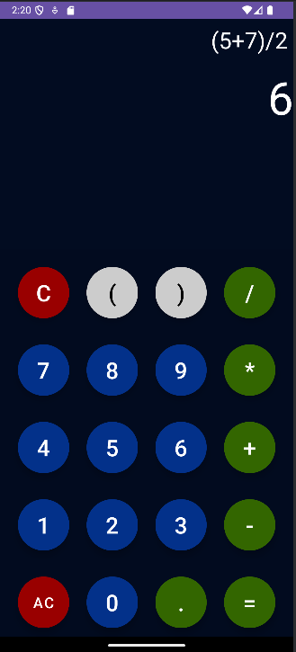

# Calculator

## Project Description
This project is a simple Android application designed to function as a basic calculator. It allows users to perform arithmetic operations like addition, subtraction, multiplication, and division. The user interface is intuitive and user-friendly, providing a smooth experience for basic mathematical calculations.

## Technologies
**Programming language**: Java

**Framework**: Android SDK

**Development Environment**: Android Studio

**Libraries/Dependencies**:
- **Material Components for Android** (com.google.android.material:material): Used for styling buttons and other UI elements in the app.
- **Rhino JavaScript Engine** (org.mozilla:rhino): Used for mathematical calculations in the app by evaluating JavaScript expressions.

## Features
- Basic arithmetic operations: addition, subtraction, multiplication, and division
- Real-time input display
- Simple and user-friendly interface
- Supports both portrait and landscape orientations
- Error handling for invalid operations (e.g., division by zero)

## Usage Instructions
1. **Clone the repository**:
   To get started, clone the repository to your local machine:
   ```bash
   git clone https://github.com/yourusername/Calculator.git
2. Open in Android Studio: Open Android Studio and select "Open an existing Android Studio project," then navigate to the folder where you cloned the repository.
3. Run the app:
- If you're using an emulator, select one from the list in Android Studio.
- Alternatively, connect a physical Android device and enable "Developer Mode" and "USB Debugging."
- Press the green "Run" button (or use Shift + F10) to build and launch the app on your chosen device.
4. Start Calculating:
  Once the app is running, you can start entering numbers and performing calculations by pressing the buttons on the interface.

## Dependencies

Before building the project, ensure the following dependencies are added to your `build.gradle` file:

```gradle
dependencies {
    implementation 'com.google.android.material:material:1.5.0'  // For Material Buttons and UI
    implementation 'org.mozilla:rhino:1.7.13'  // For JavaScript evaluation in the app
}
```

